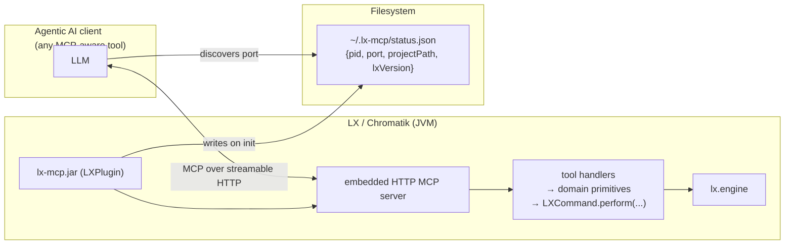
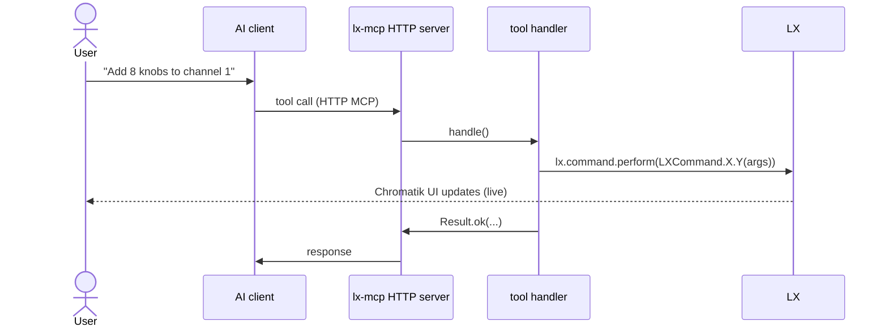

# lx-mcp

> **Status**: planning + scaffolding phase. PR-0 (Java scaffold) not yet implemented. See [docs/build-plan.md](docs/build-plan.md) for the active roadmap.

A drop-in LX/Chromatik package that embeds an MCP server inside the LX runtime, so any agentic AI client (Claude Code, Claude Desktop, Cursor, Codex, custom orchestrators) can drive a live Chromatik show — adding channels and patterns, wiring modulation knobs/buttons/triggers, routing modulators to parameters, creating MIDI mappings — while you watch the UI update.

This is **not** an official LX/Chromatik extension. It ships as a single jar; LX's existing package system loads it without any upstream changes.

## What you do

1. Build `lx-mcp.jar` (`mvn package`) or `mvn -Pinstall install` to drop it directly into `~/Chromatik/Packages/`.
2. Start Chromatik. The plugin's `initialize()` runs automatically; it starts an HTTP MCP server inside the LX runtime and writes `~/.lx-mcp/status.json` so clients can discover the port.
3. Point any MCP-aware AI client at the HTTP endpoint. Per-client install snippets land with PR-6.
4. Ask it something:
   - *"Add 8 macro knobs and wire knob 1 to channel 1's brightness."*
   - *"Map MIDI CC 7 to the master fader."*
   - *"Add a pattern bank with three patterns on a new channel."*
5. Chromatik's UI updates live. Mutations go through `LXCommand` where possible, so Cmd-Z undoes them.

## Architecture



Single process, single source of truth. The status file is the entire handshake — no sockets, no daemons, no separate Node bridge.

## A tool call, end-to-end



Mutations apply in-process; the Chromatik UI reflects them on the next frame. Because they go through `LXCommand`, Cmd-Z undoes them.

## What the AI can edit (planned)

The tool surface is intent-shaped:

- **Mixer**: list / add / remove channels, set channel parameters.
- **Patterns**: add patterns to a channel, set the active pattern, set pattern parameters.
- **Modulation**: add MacroKnobs / MacroSwitches / MacroTriggers, LFOs, envelopes; wire any modulator to any parameter.
- **MIDI mappings**: list, add, remove.
- **Parameters**: set any parameter by its canonical OSC path.

Parameter paths follow LX's existing OSC address convention.

## Trade-offs

- **AI editing requires Chromatik to be running.** The plugin lives inside the LX runtime; closed projects can't be edited.
- **Mutations not covered by `LXCommand` skip the undo stack** and document that explicitly in the tool description.
- **No per-project opt-in in v1.** All open projects are editable while Chromatik runs. A marker-modulator gating gesture (drop in to enable AI editing) is captured as a possible follow-up.

## Repo layout

```
lx-mcp/
  package/                  # Java — the drop-in jar (Maven)
    src/main/java/lxmcp/    # LXPlugin, embedded MCP server, tool handlers, domain primitives
    src/main/resources/
      lx.package            # LX descriptor (Maven token-filtered)
    pom.xml
  docs/
    build-plan.md           # the PR roadmap + progress tracker
    spike/                  # spike-phase findings (PR-1a/1b/1c)
  CLAUDE.md                 # composability rules for AI contributors
```

## License

TBD.
